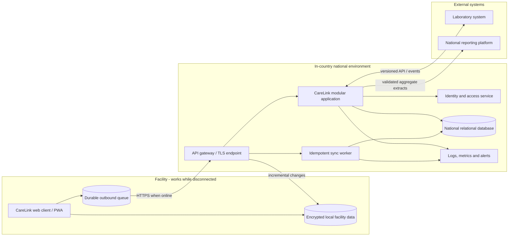

# CareLink Follow-Up architecture

## Purpose and scope

CareLink Follow-Up must give clinic staff a dependable worklist even when connectivity is poor, while allowing district and national teams to see current operational information. The first release is due in nine months and the delivery team is relatively small. I would therefore extend the existing CareLink platform as a **modular monolith with an offline-capable facility client**, rather than begin with many independently deployed services.

The SQLite database in Section B is a portable assessment implementation. In production, each facility would retain a local operational database and the national platform would use a supported in-country relational database such as PostgreSQL or SQL Server.

## Proposed components and data flow

The browser client calls versioned JSON APIs over HTTPS. At a reliably connected site it communicates directly with the national API. At an intermittently connected site, the existing facility installation exposes the same logical API locally, stores authorised facility data, and maintains a durable synchronisation queue. This avoids creating two unrelated application behaviours.

The national application is divided internally into modules for follow-up, patient/visit access, identity and integrations. Modules have explicit interfaces and separate database ownership conventions, but are deployed together initially. Background workers perform synchronisation and external-system work so a slow partner does not block clinical screens.

## Data placement and reconciliation

Facility storage contains the minimum data needed for local care: patients assigned to that facility, recent and active clinical records, the follow-up worklist, user access information with an expiry, and pending locally created operations. It must not contain national extracts or unrestricted records from other facilities.

The national store is the authoritative longitudinal record, cross-facility patient identity, access assignments, audit history, synchronisation metadata and reporting-ready data. Reporting extracts are derived from validated national records rather than queried from clinic devices.

Every locally created operation receives a client-generated operation ID, facility ID, device ID, user ID and local timestamp. The sync API treats the operation ID as an idempotency key, so replaying a request cannot create a second visit. Server sequence numbers provide ordered incremental downloads. The server validates authorisation and clinical constraints again; it never trusts the offline client simply because it was previously authenticated.

Routine non-conflicting changes merge automatically. Concurrent clinical changes are retained as versions and presented for reconciliation rather than silently overwriting one another. Patient duplicates are linked through a reviewed merge process with a surviving identity and full audit trail; clinical rows are not casually deleted.

## API and external integrations

Public endpoints use a version prefix, typed contracts, consistent problem responses, correlation IDs, pagination and documented compatibility rules. Follow-up queries are filtered and paginated in the database. Write endpoints accept an idempotency key and use optimistic concurrency versions.

The laboratory integration should use an asynchronous adapter: receive or poll results using the laboratory's supported standard, validate and map identifiers, quarantine invalid messages, retry transient failures, and acknowledge only durable processing. Where available I would prefer a health-data standard such as FHIR, but use an adapter so CareLink's internal model is not tied to one partner format.

The reporting platform receives scheduled, validated aggregate or de-identified extracts through a versioned interface. It should not query the transactional clinical database directly. Each export has a manifest, record counts and a reconciliation status so missing or duplicate reporting batches are visible.

## Authentication and authorisation

Online authentication should use the Ministry-approved identity provider with short-lived signed tokens and multi-factor authentication for privileged roles. Authorisation is enforced by the API using role plus assigned geographic scope:

| Role | Access |
| --- | --- |
| Clinician | Read and write permitted clinical data for assigned facility only |
| Facility administrator | Manage facility users/configuration and view facility operations; no automatic unrestricted clinical-edit permission |
| District officer | Read authorised operational data across assigned district; no clinical writes |
| National user | Read national operational or reporting views; exceptional write privileges require a separate audited role |

Offline login uses a previously provisioned device, encrypted cached credentials or platform keys, and a time-limited offline grant containing the user's role and facility scope. Revocations cannot arrive while disconnected, so offline grants expire and high-risk administration is unavailable offline. All offline actions retain the acting user and are re-authorised during synchronisation.

## Client behaviour during outages

The client displays a clear online, offline or synchronising state and the time of the last successful sync. Reads use the encrypted local dataset and are labelled with their freshness. Supported writes are stored durably before the interface reports them as saved, then shown as pending until acknowledged by the server. Users can inspect failed or conflicted operations and retry safe failures. Features requiring current national data are disabled with an explanation rather than appearing to succeed.

The queue preserves causal ordering per patient, retries transient failures with exponential back-off and jitter, and stops retrying permanent validation failures. Synchronisation is resumable in small batches so an interruption does not restart an entire multi-day upload.

## Health measures clinicians can recognise

Technical dashboards should translate into service impact. I would monitor and alert on:

- percentage of facilities successfully synchronised in the last 24 hours and the oldest unsynchronised facility;
- age and size of each facility's pending queue: "42 visits waiting, oldest 6 hours";
- time to open the follow-up list and percentage of requests that fail;
- number of duplicate, rejected and conflicted records awaiting review;
- whether laboratory results and reporting batches arrive within agreed times;
- error rate and release health by application version, facility and connectivity class, without logging patient details;
- backup completion and tested restore time.

## Deployment and release approach

National services, databases, backups and observability data are hosted in an approved in-country data centre or cloud region. Data is encrypted in transit and at rest, secrets are held outside source code, access is audited, and retention follows Ministry policy.

Changes pass automated build, migration, security and contract tests. Releases use backward-compatible database expansion first, then application deployment, then later cleanup. A small pilot group representing reliable, intermittent and offline facilities receives the release first. Feature flags allow Follow-Up to be enabled gradually, and the previous compatible application version remains available for rollback. Facility packages are signed, resumable and tolerant of old clients during the rollout window.

## Significant trade-offs

1. **Modular monolith over microservices.** Independent services could scale and deploy separately, but would add network failure modes, distributed data consistency and operational overhead for a nine-person engineering team. Clear module boundaries preserve a later extraction path.
2. **Facility data store plus synchronisation over online-only operation.** Online-only is simpler and provides immediately current data, but excludes roughly 1,100 facilities whenever their connection is unreliable. The chosen design accepts sync and conflict complexity to preserve clinical work.
3. **Relational database over a document database.** A document store can make offline replication convenient, but CareLink needs constraints, joins, migrations, auditability and predictable reporting. Relational storage better protects the core clinical relationships.
4. **Incremental local dataset over a full national copy.** A full replica makes cross-facility reads easy but creates unacceptable privacy, storage and update costs on shared 4 GB computers. The facility receives only its authorised operational subset.
5. **Asynchronous partner integration over synchronous calls in the clinical request.** Synchronous calls provide immediate confirmation but make clinic work depend on external-system availability. Durable asynchronous exchange is more resilient and reconcilable.

## Five largest technical risks

| Risk | Why it matters | Reduction |
| --- | --- | --- |
| Sync creates duplicates or loses updates | An incorrect patient history can affect care | Idempotency keys, versions, per-patient ordering, reconciliation UI and invariant tests |
| Sensitive data is exposed on shared or stolen devices | Health information has legal and personal consequences | Minimum local dataset, encryption, short offline grants, device registration, remote revocation and audit |
| Old clients become incompatible during slow rollout | Offline facilities may remain on an old version for days | Versioned contracts, compatibility window, expand/contract migrations and signed resumable updates |
| National morning peak or very large worklists cause delays | Staff cannot use the system between patients | Indexed server-side queries, pagination, load tests, caching of safe reference data and capacity alerts |
| External laboratory/reporting failures silently create gaps | Care or programme decisions use incomplete data | Durable queues, acknowledgements, reconciliation counts, dead-letter review and freshness alerts |

## Decision I am least confident about

The least certain decision is how much clinical data to cache at each facility. Too little prevents useful work during a two-day outage; too much increases privacy, storage and stale-data risk. I would decide it with clinicians, information-security staff, measured outage durations and device-capacity data, then pilot at rural facilities before fixing the retention window.
